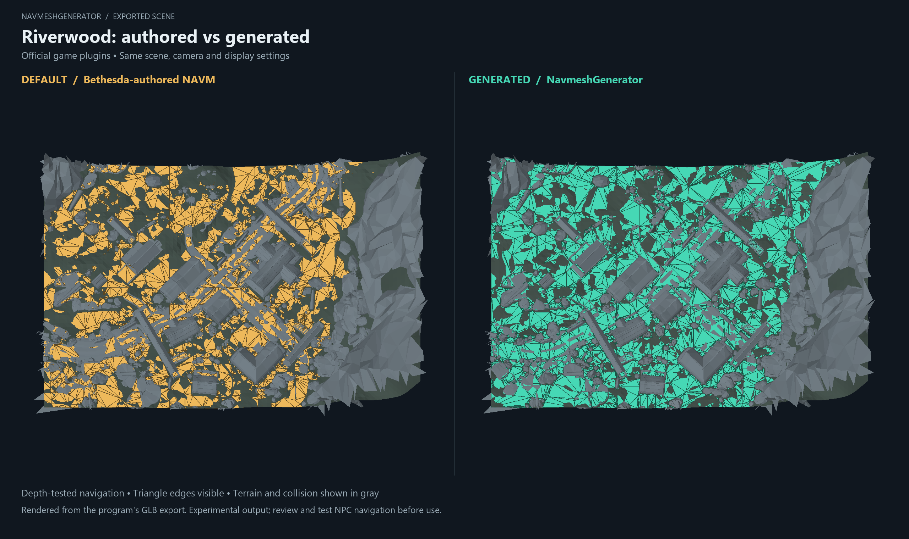

# NavmeshGenerator

NavmeshGenerator helps Skyrim Special Edition and Anniversary Edition modders
inspect and rebuild navmeshes: the walkable areas that NPCs use to move through
the world. It uses your existing Mod Organizer 2 profile and can export a patch
or a copy of a selected plugin with regenerated navigation.

The tool is experimental. Review generated navigation before using it in a
regular playthrough.

## Riverwood comparison

The panels show Bethesda-authored and generated navigation over the same
Riverwood village scene from the official game plugins. Gray geometry shows
terrain and collision; both panels use the same camera and depth testing.

This is a rendered program export, not an in-game NPC test. See the
[scene image rendering guide](docs/render-media.md) for export instructions.

## Before you start

You need:

- Windows and a Skyrim SE/AE installation.
- An existing Mod Organizer 2 instance with a configured profile.
- The mods you want to work with enabled in that profile.

Start with `NavmeshGenerator.exe`. Archived models are read by the native
application and cached on demand. For source builds, follow the
[setup guide](docs/development.md).

## Get started

1. Open `NavmeshGenerator.exe` to launch the desktop window.
2. Choose your **MO2 folder** and enter your existing **Profile** name.
3. Choose a fresh **Output folder** for the results.
4. Select a **Rebuild scope** from the table below.
5. Choose the output you want, then run the operation.

| Scope | What it works on |
| --- | --- |
| **Cell** | One or more cells you choose by Form ID or editor ID. |
| **Plugin** | Cells affected by a selected active plugin. |
| **Load order** | Cells affected by changes across your active mods. |

If you need a cell identifier, use **List cells to file** to export the available
cells to `cells.json`. In **Cell** scope, paste identifiers into **Cells**, one
per line; commas and semicolons also work.

Hover over the `?` controls for help. Your settings are saved for the next session.

## Choose what to produce

- **Inspect a cell:** select Cell scope and leave generation and plugin writing
  disabled to export the existing navigation and surrounding geometry.
- **Preview generated navigation:** enable **Generate candidate NAVM** to inspect
  a proposed navmesh before writing a plugin. NAVM is Skyrim's navmesh record.
- **Make a scene from multiple cells:** select **Cell**, enter the identifiers in
  **Cells**, and enable **Make scene**. One `scene.glb` in the output folder combines
  their geometry and navigation. This also works with generation and
  **Copy selected plugin**.
- **Create a patch:** enable **Write plugin** to export `generated-navmesh.esp`.
  A numeric suffix is added when that filename is already active in the load order.
- **Update your own mod:** select Plugin scope and enable **Copy selected plugin**
  to export a copy with regenerated navigation and the plugin's other records.
- **Rebuild chosen cells in your mod:** select **Cell**, fill **Cells**, and enable
  **Copy selected plugin**. Enter the active filename in **Plugin to copy** to
  write those cells' regenerated navigation into the exported copy.
- **Fill areas without navmeshes:** enable **Skip cells with existing navmesh**
  during generation to preserve areas that already have navigation.

### Settings and larger runs

For larger Plugin or Load order runs, use the estimation option to check the
expected workload before generation.

**Advanced settings** contains generation and performance controls. Start with
the defaults; use **Reset** to adopt current numerical defaults if you already
have saved settings. See the [desktop settings guide](docs/operator-workflow.md#advanced-generation-settings)
for tuning and water/preferred-path tagging options.

## Review and use the results

### Inspect the output

The output folder contains the files for your chosen operation:

- **`scene.glb`:** cell inspection and candidate previews include a scene you can
  open in a compatible 3D viewer or Blender to compare navigation with the world.
- **`navmesh-counts.txt`:** original and generated polygon counts.
- **Reports:** warnings, skipped areas, and export results. For batch runs, check
  `batch-report.json` for cells that failed or were skipped.

Batch output depends on the selected output policy. Some cell failures allow
the rest of the batch to complete, so review the reports even after a successful
export. See [batch rebuilding](docs/batch-rebuilding.md) for selection, connection
handling, and failure policies.

### Install and test

Install a generated patch through MO2 and load it after the plugins it depends
on. A **Copy selected plugin** export replaces the selected plugin; use it with
the original mod's assets and language files.

Input plugins and MO2 profile files are left untouched. Existing output plugins
are not overwritten, so choose a new output folder when repeating an export.

## Current limitations

Some collision shapes and modded data are unsupported. Areas without enough
usable geometry may be skipped or produce incomplete navigation. Door and
cell-border connections also need review: a successful export does not guarantee
that NPCs can reach every intended area.

Check generated plugins in the Creation Kit or other inspection tools, then
test NPC movement in a separate game profile before adopting them.

## Further help

- [Desktop workflow and settings](docs/operator-workflow.md#desktop-workspace)
- [Viewing exported scenes](docs/scene-inspection.md)
- [Navmesh terms and cell connections](docs/glossary.md)
- [Command-line options, output files, and detailed limitations](docs/command-line.md)
- [Batch rebuilding and affected-cell selection](docs/batch-rebuilding.md)
- [Generation algorithm and connection handling](docs/candidate-surface-algorithm.md)
- [Build, dependencies, and development](docs/development.md)
- [Architecture](docs/architecture.md) and [C++ API reference](docs/api.md)

## Acknowledgments

Thanks to [Sw4T's BSAFileExtractor](https://github.com/Sw4T/BSAFileExtractor)
and [Stephen Bunn's bethesda-structs](https://github.com/stephen-bunn/bethesda-structs)
for helping establish the project's initial BSA extraction workflow and archive
format understanding. The current native reader and standalone Python reference
tool operate independently of these projects.
